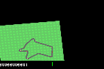
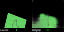

# World Models — hands-on, end-to-end

A small, runnable implementation of [Ha & Schmidhuber 2018, *World Models*](https://worldmodels.github.io/)
on Gymnasium's `CarRacing-v3`. Built in one ~3-hour session as a learning
project. Everything trains on a Mac with **MPS** (Apple Silicon GPU) — no
CUDA, no cluster.

| Trained agent driving (return +78.4) | M's "dream" — left real, right imagined |
|:---:|:---:|
|  |  |

## The big idea

Traditional model-free RL learns a single neural net that maps pixels →
actions, end-to-end, all from the reward signal. That's hard: the reward
is sparse, the network has to learn *perception*, *prediction*, and
*control* simultaneously, and pixel inputs are huge.

A **World Model** factors the agent into three pieces and trains them
**separately**:

```
            ┌──────────┐    z_t       ┌──────────┐                ┌──────────┐
 obs_t ───▶ │ V (VAE)  │ ──────────▶  │ M (MDN-  │ ─[h_t]────────▶│ C        │ ──▶ a_t
            │ encoder  │              │  RNN)    │                │ (linear) │
            └──────────┘              └──────────┘                └──────────┘
                  │ decoder
                  ▼
            obs_t reconstructed       (predicts z_{t+1} as a GMM)
```

| Module | What it learns | How it's trained | Params |
|---|---|---|---|
| **V** — VAE | "What does the world *look like*?" — compress 64×64×3 frames into a 32-dim latent. | Reconstruction loss (BCE) + KL on rollouts collected by a *random* policy. | ~4M |
| **M** — MDN-RNN | "How does the world *evolve*?" — given (z_t, a_t), predict a Gaussian-mixture distribution over z_{t+1}. | Negative log-likelihood on encoded rollouts. | ~700k |
| **C** — controller | "What should I *do*?" — map [z_t, h_t] → action. | CMA-ES on real-env returns. | **867** |

### Why this is interesting

1. **It works with random data.** V and M never see "good" gameplay — they
   learn from pure random exploration. Only C cares about reward.
2. **C is tiny.** A single linear layer, ~1k parameters. The hard work
   happened upstream. This is what makes evolution feasible — CMA-ES
   scales poorly past ~10k parameters.
3. **The agent can dream.** Once M is trained, you can ask it "what
   happens if I do X?" without touching the real environment. The famous
   demo: train C inside the dream, deploy in reality.

### Why a *mixture* density network

The world is non-deterministic from the agent's view. Approaching a
corner, the next frame might be "tree on left" or "tree on right" — a
single-Gaussian predictor would average those into "tree in the middle,"
which is wrong. A GMM with K components lets the model commit to multiple
plausible futures, weighted by mixing probabilities π_k.

### Why CMA-ES, not PPO

CarRacing's reward is *not* differentiable through the env. With a
~1k-parameter controller, evolution strategies are competitive with
gradient methods *and* don't need a rollout buffer or value estimator.
[CMA-ES](https://en.wikipedia.org/wiki/CMA-ES) maintains a multivariate
Gaussian search distribution and updates its mean and covariance toward
better candidates each generation.

## Repo layout

```
src/world_models/
    config.py        single source of truth for hyperparameters
    env.py           gymnasium factory + frame preprocessing
    vae.py           V — encoder + decoder + reparam trick + loss
    mdn_rnn.py       M — LSTM with mixture-density head + sampling
    controller.py    C — tiny linear/MLP policy; flat-vector interface for CMA-ES
    data.py          frame dataset + (z, a) sequence dataset
    utils.py         device pick + seed utilities
scripts/
    collect_rollouts.py    random rollouts -> data/rollouts/*.npz
    train_vae.py           train V, save reconstruction grids
    encode_rollouts.py     V -> data/latents/*.npz
    train_rnn.py           train M on encoded sequences
    train_controller.py    CMA-ES on the live env
    play.py                full V+M+C agent in env, save video + GIF
    dream.py               side-by-side real vs. M-imagined rollout
```

## Running it

Order matters — each step consumes the artifact from the previous one.

```bash
uv sync                                                       # one-time install
uv run python scripts/collect_rollouts.py                     # ~30s — 12 rollouts, 9.6k frames
uv run python scripts/train_vae.py --epochs 6                 # ~40s on MPS
uv run python scripts/train_vae.py --resume --epochs 12       # ~65s more
uv run python scripts/encode_rollouts.py                      # ~1s — V on every frame
uv run python scripts/train_rnn.py                            # ~25s on MPS
uv run python scripts/train_controller.py --pop 8 \
    --generations 6 --episodes 2 --max-steps 600              # ~4.5 min — CMA-ES
uv run python scripts/evaluate.py --episodes 5                # honest mean over 5 unseen seeds
uv run python scripts/evaluate.py --random --episodes 5       # random baseline
uv run python scripts/play.py --seed 101                      # writes videos/play.mp4 + .gif
uv run python scripts/dream.py --steps 120                    # writes videos/dream.gif
```

All knobs (epochs, batch sizes, model sizes, CMA-ES population, etc.)
live in `src/world_models/config.py`. Bump them up to push the agent
further; the 2-3h budget here is intentionally tight.

## Results from one 2-hour session

A single end-to-end run on a 16GB Apple Silicon Mac (MPS), seed 42:

| Stage | Wall clock | Final value |
|---|---|---|
| 12 random rollouts (9.6k frames) | 26 s | — |
| VAE training (18 epochs total) | ~100 s | recon BCE 8521 → 6679, KL 0.01 → 22 |
| Encode all frames to z | 0.6 s | — |
| MDN-RNN training (6 epochs) | 23 s | NLL → −76.5 |
| **Controller** (CMA-ES, pop 8, 6 gens, 2 ep/eval) | **266 s** | **best gen-best +54.0** |

Final scores on 5 *unseen* track seeds (seeds 100–104), 800-step cap:

| Policy | mean | std | min | max |
|---|---:|---:|---:|---:|
| Random | +9.5  | 21.7 | −10.7 | +49.6 |
| **World Model agent** | **+20.6** | 46.7 | −29.8 | **+78.4** |

The agent **clearly beats random on average** despite using only 867
controller parameters and 144 candidate-evaluation episodes of training.
Best-case episodes (+78, +75) show the controller can drive
non-trivially; worst-case episodes (−30) show it still spins out on
sharp curves.

### A debugging lesson worth keeping

In an earlier run we evaluated each CMA-ES candidate on a **single**
episode with 600-step cap. CMA-ES happily reported `best=+53.3` — but on
5 unseen seeds the same controller scored **−5.3 mean**, *worse* than
random. The "+53.3" was a single lucky track seed, not a real signal.

The fix was raising `--episodes 2` (averaging two unseen tracks per
candidate), which cuts evaluation noise by ~√2. A real-world deployment
would use 5–16 episodes per candidate. The lesson: **for evolution
strategies on stochastic environments, eval noise eats your search
signal**, and the cheapest fix is more rollouts per candidate before
more candidates per generation.

## What the artifacts look like

| File | What it shows |
|---|---|
| `assets/vae_recon.png` | 8 real frames over 8 V reconstructions. Recon is intentionally blurry (vanilla β-VAE) but captures track angles + car position. |
| `assets/dream.gif` | 60 side-by-side `(real | dream)` frames. Right side decoded from M's GMM samples, seeded by one real frame. |
| `assets/play.gif` | The trained agent driving on seed 101 (return +78.4). |
| `checkpoints/*.pt` | VAE, MDN-RNN, controller weights. |

## Where to go next

- **More rollouts.** 10k frames is the bare minimum for V; 1M+ frames is
  what the original paper used.
- **More episodes per CMA-ES candidate.** As above — 5-16 episodes
  smooths the signal enough that sigma can be small without overfitting.
- **Train C in dreams.** Replace `train_controller.py`'s real-env eval
  with an M-rollout. This is the headline demo of the paper.
- **Bigger M.** A multi-layer LSTM or a small transformer dramatically
  improves long-horizon hallucination quality.
- **Discrete envs.** `CarRacing-v3` with `continuous=False` simplifies
  the controller. Atari via `ale-py` works with the same V+M backbone if
  you swap in a stack of grayscale frames.

## References

- Ha & Schmidhuber, *World Models* (2018) — https://worldmodels.github.io/
- Hansen, *The CMA Evolution Strategy: A Tutorial* (2016)
- Kingma & Welling, *Auto-Encoding Variational Bayes* (2014)
- Bishop, *Mixture Density Networks* (1994)
