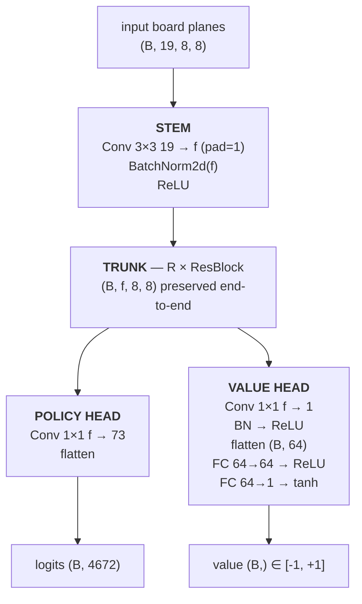
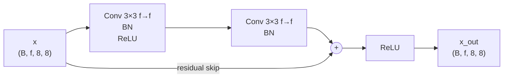

# 02c — Scaled-up Stockfish distillation

> **Sibling of 02b.** Same idea (supervised distillation from Stockfish,
> not real AlphaZero RL), but every dial turned up. The question: how
> close can pure distillation get to the teacher when we stop pinching
> pennies on data, targets, and capacity?

## What changes vs 02b

| Dial | 02b (d10 run, 1185 Elo) | 02c |
|---|---|---|
| Network | 10 blocks × 128 ch (~3M params) | **20 blocks × 256 ch (~21M params)** |
| Stockfish teacher | depth=10 (~2200 Elo) | **depth=15 (~2500 Elo)** |
| Policy target | hard one-hot of SF's chosen move | **multipv=8 softmax over top-8 SF moves** |
| Games generated | 2,000 | **4,000** |
| Positions | ~250k | ~300–400k |
| Eval sims | 800 | 800 (baseline) + 1600 (stretch) |

The single most important change is **multipv soft targets**: instead
of teaching the student "Stockfish played e4 here," we teach it
"e4 ≈ 38%, Nf3 ≈ 28%, c4 ≈ 18%, ..." Each position now carries the
teacher's full ranking, not just its argmax.

## Vocabulary: multipv, softmax T in pawns, target shape

Three terms come up everywhere in this README. Quick definitions:

**multipv (multi-PV)** — a standard chess-engine setting. By default
`MultiPV=1` returns the engine's single best move + continuation +
score. With `MultiPV=K` Stockfish returns its **top-K moves**, each
with its own continuation and centipawn score. Stockfish shares the
alpha-beta tree across the K lines, so `MultiPV=8` is only ~1.3–1.7×
slower than `MultiPV=1` at the same depth — not 8× slower. We use it
to record SF's whole top-of-ranking, not just its argmax.

**Softmax T in pawns** — the temperature used to convert SF's
centipawn scores into a probability distribution:

> `p_i ∝ exp(score_i_cp / (100 · T))`

The `/100` rescales centipawns to pawns, so `T` has units of **pawns
of evaluation** — intuitive at the chess scale.

| T (pawns) | 50cp gap → split | 200cp gap → split | What it looks like |
|---:|---:|---:|---|
| ∞ | 50/50 | 50/50 | uniform over top-K |
| 1.0 | 62/38 | 88/12 | what 02c used; "still listening" |
| 0.3 | 84/16 | 99.9/0.1 | sharper; "committing but hedging" |
| 0.05 | ~100/0 | ~100/0 | effectively hard one-hot |

Mate scores get clipped to ±1000 cp before softmaxing so a forced
mate doesn't collapse the distribution to one-hot — that would erase
information about non-mating-but-still-good alternatives.

**Target shape** — the *shape* of the per-position probability
distribution the student tries to match. Two regimes you can run on
identical data:

| Target shape | Per-position target | Loss | Used by |
|---|---|---|---|
| **Hard one-hot** | `played_move = 1.0`, all others = 0 | `F.cross_entropy(logits, played_move)` | 02b |
| **Soft multipv** | softmax(scores/100T) over top-K, 0 elsewhere | `-Σ p · log_softmax(logits)` | 02c |

Spike vs bell. Information-theoretically the soft target carries
more bits per position; empirically at d10 teacher quality, the spike
actually trains a stronger player at 800 sims (the *hedging failure
mode* in [results.md](./results.md) hypothesis #1). That's what makes
Experiment A (same 02c data + 20×256 net, but hard targets) the
single-variable ablation that pins blame on either the target shape
or the network size.

## How multipv soft targets work

For each visited position we call
`engine.analyse(board, depth=D, multipv=K)`. This is ONE Stockfish
search; internally SF keeps K principal variations alongside its normal
alpha-beta, so it's only ~1.3-1.7× slower than `multipv=1`. The K
returned PVs each have a centipawn score from the side-to-move's POV.
We softmax those scores at temperature T (in pawns):

```
p_i ∝ exp(score_i_cp / (100 * T))
```

with mate scores clipped to ±1000 cp so a forced mate doesn't collapse
the distribution. T=1 pawn means a 50cp gap → roughly a 62/38 split
between the two moves; large enough to be informative, small enough not
to encourage the student to play obviously-worse moves.

The training loss is a standard soft-target cross-entropy:

```
loss = -Σ p_target_i * log_softmax(logits)_i
```

scattered through the K-sparse target into the 4672-action vector.

## Why pick a bigger network

A 10×128 net (3M params) is genuinely too small to absorb a strong
teacher's positional knowledge. The 02b d10 run plateaued at 65.6%
top-1 even when the teacher was much stronger than the student —
classic capacity-bound symptom. The paper-sized 20×256 (~21M params)
gives the student room to actually fit teacher behavior.

## Network architecture

A standard AlphaZero-style ResNet with two heads. All shapes assume
batch size `B`, `f = n_filters`, `R = n_res_blocks`. Default is `f=256`,
`R=20`.



Each `ResBlock` (R of them stacked, default R=20):



**Move encoding (4672 = 8 × 8 × 73):**
- planes 0..55: queen-like (8 directions × 7 distances)
- planes 56..63: 8 knight jumps
- planes 64..72: underpromotion (3 pieces × 3 directions)
- queen-promotion lives in the queen-like planes (pawn forward to last rank)
- index = `plane * 64 + from_square`

**Board encoding (19 planes, white's POV):**
- 0..5: white P, N, B, R, Q, K (one-hot per square)
- 6..11: black P, N, B, R, Q, K
- 12: side-to-move (all-ones plane if white to move)
- 13..16: castling rights (W-king, W-queen, B-king, B-queen)
- 17: en-passant target (one-hot)
- 18: halfmove clock / 100 (no-progress count)

**Param count by config**

| Config | n_blocks | n_filters | ~Params | Used by |
|---|---:|---:|---:|---|
| 02b small | 10 | 128 | ~3.0M | 02b d10 (1185 Elo) |
| 02c default | 20 | 256 | ~21M | 02c-30ep run (1086 Elo) |

Per ResBlock: `2 × (f²·9 + 2f) ≈ 2f² · 9` (dominant term), so doubling
filters quadruples each block. Doubling blocks doubles trunk cost
linearly. 20×256 vs 10×128 ≈ 8× params, ≈ 16× FLOPs per forward pass.

## Checkpoint indexing

A `.pt` file alone is **not self-describing** — to load it you need to
know `(n_blocks, n_filters)` and the data provenance. The library
path-scheme used for datasets (see "Dataset library" below) is mirrored
for checkpoints:

```
checkpoints/sf-<v>/d<D>-mpv<K>-T<T>/g<N>-seed<S>/net-<R>x<F>/<run-id>/
```

**Each segment means:**

| Segment | Stands for | Example | Source |
|---|---|---|---|
| `sf-<v>` | Stockfish **teacher** version | `sf-18`, `sf-14.1` | detected from UCI banner |
| `d<D>-mpv<K>-T<T>` | Dataset config: search depth, multipv width, softmax T in pawns | `d10-mpv8-T1`, `d15-mpv8-T0.3` | gen args |
| `g<N>-seed<S>` | Games + RNG seed used to generate them | `g4000-seed42` | gen args |
| `net-<R>x<F>` | ResNet config: R blocks × F filters per block | `net-10x128` (~3M), `net-20x256` (~21M) | training args |
| `<run-id>` | Target shape + timestamp (so re-runs don't collide) | `soft-2026-05-12T15Z`, `hard-2026-05-13T09Z` | training args |

**Worked example.** This concrete path:

```
checkpoints/sf-18/d10-mpv8-T1/g4000-seed42/net-20x256/soft-2026-05-12T15Z/
    manifest.json
    epoch_000.pt
    epoch_005.pt
    epoch_029.pt
    latest.pt -> epoch_029.pt
    train_history.json
```

…fully decodes to: "Stockfish-18 teacher at depth 10, multipv 8,
softmax T=1 pawn, 4000 games with seed 42, distilled into a 20×256
ResNet (≈21M params) using soft cross-entropy targets, training started
2026-05-12 15:00 UTC, last saved epoch is 029." Anyone (or any script)
can derive every hyperparameter from the path alone.

**Symmetry with the data library.** The first three segments are
identical to `data/library/sf-<v>/d<D>-mpv<K>-T<T>/g<N>-seed<S>/`, so
stripping the last two path components gives you the dataset the model
was trained on — no separate index needed.

**Current status: not yet implemented.** Today's ckpt dirs across the
repo are free-form (`checkpoints_v3c/`, `checkpoints_v4/`,
`aws_results/run02_30ep/`, …) and contain no architecture sidecar, so
loading any of them requires the user to pass `--n-blocks/--n-filters`
explicitly. The scheme above is the planned fix; see the open question
at the end of this README.

## AWS / cloud architecture

Everything lives in `infra/` and is one `terraform apply` away. The
shape of the deployment — explicitly minimal so it's a one-shot
experiment box, not production infra:

```
   developer laptop                         AWS  (us-east-1 by default)
   ┌────────────────────┐
   │  infra/*.tf        │ ── terraform plan/apply ──▶ AWS API
   │  AWS creds in env  │                              │
   └─────────┬──────────┘                              │ provisions
             │                                          ▼
             │                              ┌──────────────────────────┐
             │                              │  Default VPC (per region)│
             │                              │                          │
             │                              │  ┌─ Security Group ──┐   │
             │                              │  │ ingress 22/tcp    │   │
             │                              │  │  from var.allowed_│   │
             │                              │  │  ssh_cidr         │   │
             │                              │  │ egress all (apt,  │   │
             │                              │  │  pip, github)     │   │
             │                              │  └───────────────────┘   │
             │                              │                          │
             │                              │  Subnet (filtered to     │
             │                              │   AZs where var.instance │
             │                              │   _type is actually      │
             │                              │   offered — uses         │
             │                              │   aws_ec2_instance_type_ │
             │                              │   offerings data source) │
             │                              │           │              │
             │                              │           │ launches     │
             │                              │           ▼              │
             │                              │  ┌────────────────────┐  │
             │   ssh / rsync / scp          │  │ EC2 instance       │  │
             ├─────────────────────────────▶│  │  AMI: AWS DL Base  │  │
             │      (public IPv4)           │  │   GPU AMI (Ubuntu) │  │
             │                              │  │  type: var.        │  │
             │                              │  │   instance_type    │  │
             │                              │  │  market: spot or   │  │
             │                              │  │   on-demand        │  │
             │                              │  │   (var.use_spot)   │  │
             │                              │  │                    │  │
             │                              │  │  user_data.sh:     │  │
             │                              │  │   apt: stockfish,  │  │
             │                              │  │     htop, tmux, jq │  │
             │                              │  │   uv install       │  │
             │                              │  │                    │  │
             │                              │  │  Root EBS:         │  │
             │                              │  │   gp3, 200 GB,     │  │
             │                              │  │   delete-on-       │  │
             │                              │  │   termination      │  │
             │                              │  └────────┬───────────┘  │
             │                              │           │              │
             │                              │           │ work dir:    │
             │                              │           ▼              │
             │                              │  ~/02c-distill-scaled/   │
             │                              │     data/library/...     │
             │                              │     checkpoints/...      │
             │                              │     scripts/run_         │
             │                              │       overnight.sh       │
             │                              └──────────────────────────┘
             │
             ▼ on teardown:
   `terraform destroy -auto-approve`  →  instance, SG, EBS all deleted
```

**What this gets us:**
- One command (`terraform apply`) → everything provisioned.
- One command (`terraform destroy`) → everything billed gone.
- `terraform output rsync_command` and `ssh_command` give paste-ready
  strings, so there's no infra-state in your head between sessions.
- `var.instance_type` is the single dial for scale; the Terraform
  module auto-filters subnets to AZs where that instance type is
  actually offered (we hit this with `g5.24xlarge` not being in
  `us-east-1e`, lost an hour to it once — the filter is the fix).

**What's deliberately NOT in this architecture:**

| Not included | Why |
|---|---|
| S3 / shared storage | One-shot box; pull results back via `scp`. No "team-shared" experiments. |
| Custom VPC, NAT, IAM roles | Default VPC + SSH key is enough. Don't run this in a prod account; use a sandbox. |
| Auto-scaling group / multiple instances | Single experiment, single box. Multi-host coordination isn't worth it at this scale. |
| Stateful Terraform backend (S3 + DynamoDB) | `terraform.tfstate` is local; fine for one engineer running occasional experiments. |
| SSM Session Manager / IAM instance profile | Plain SSH key access is simpler. (Cost: when an instance can't be SSHed to, you can't recover it — happened once.) |
| Code baked into AMI or pulled via user_data | `rsync` from laptop after boot — lets you iterate locally without re-provisioning. |

**Cost discipline.** Spot is default (~70% off on-demand). 02c-30ep
end-to-end on `g5.8xlarge` spot was ≈ $9. The risk is reclamation
mid-run: that's why the data-gen chunking refactor exists (see "Dataset
library" above) — a spot kill now loses ≤ `chunk_size` games per
worker, not the whole run.

### Two-box split pipeline (the cheapest end-to-end)

The 02c-30ep `g5.8xlarge` run cost ~$9 but ~60% of that bill went to
**GPU idle time** during the CPU-bound phases (data gen, eval).
Sizing each phase to the cheapest instance that fits its bottleneck
brings the bill down to **~$1.15** for the same pipeline:

| Phase | Bottleneck | Instance | Spot $/h | ~Wall | ~Cost |
|---|---|---|---:|---:|---:|
| 1: data gen | Stockfish CPU | `c7i.8xlarge` (32 vCPU CPU only) | $0.34 | 28 min | $0.16 |
| 2: training | A10G GPU | `g5.xlarge` (1 A10G, 4 vCPU) | $0.30 | 75 min | $0.38 |
| 3: eval × 2 sim budgets | MCTS + SF CPU | `c7i.8xlarge` | $0.34 | 90 min | $0.51 |
| Bootstrap overhead | 3 × ~3 min | | | | $0.10 |
| **Total** | | | | **~3h** | **~$1.15** |

That's **~7–8× cheaper** than the all-on-one-GPU box. The orchestrator
that drives this is [`scripts/run_split_pipeline.sh`](./scripts/run_split_pipeline.sh):

```bash
# Required: an AWS EC2 key pair you've already created in the region.
KEY_NAME=mykey bash scripts/run_split_pipeline.sh
```

What it does, per phase:

1. `terraform apply` with the right `instance_type` for the phase
2. Waits for `/home/ubuntu/BOOTSTRAP_COMPLETE` (proves user_data is done)
3. `rsync` the project up; `uv sync` to install deps
4. `rsync` any input artifact up (dataset for Phase 2, ckpt for Phase 3)
5. Runs the phase remotely, streaming stdout back to your terminal
6. `rsync` outputs back to the laptop (`data/`, `checkpoints/`, logs)
7. `terraform destroy` — no resource left billing

Each handoff is one small file: dataset NPZ ~1.5GB (Phase 1 → 2),
checkpoint .pt ~80MB (Phase 2 → 3). No S3 needed; the laptop is the
intermediary.

**Resumability.** Each phase is idempotent if you keep the local
artifacts: `START_PHASE=2` skips Phase 1 and uses `data/<existing>.npz`.
If Phase 2 dies mid-training, any per-epoch ckpt that was saved before
the crash is pulled back; re-run with `START_PHASE=2` to retry on a
fresh GPU box.

**Risk it doesn't address.** A spot reclamation **during** a phase
still aborts that phase. For Phase 1, the chunked data library means
≤ `--chunk-size` games per worker are lost. For Phase 2, you keep all
already-saved epoch checkpoints (saved every 5 epochs by default), so
you lose at most 5 epochs of training. For Phase 3, you lose only the
in-progress sim budget — the other one survived.

## Layout

```
src/azdistill_scaled/
    board.py, network.py, mcts.py, arena.py, config.py  — copied from 02b
    stockfish_data.py    — NEW: multipv-aware data generation
    train_supervised.py  — NEW: soft-CE loss against multipv distribution
scripts/
    generate_data.py     — CLI wrapper for data gen
    train.py             — CLI wrapper for training
    eval.py              — 100 games vs Stockfish UCI_Elo=1320 (same as 02b)
    run_overnight.sh     — full pipeline: generate → train → eval
data/, checkpoints/      — gitignored outputs
```

## Dataset library

Data generation now supports a structured library indexed by Stockfish
metadata, so multiple data runs coexist without filename collisions and
can be cross-referenced from checkpoints:

```
data/library/
  sf-<version>/d<D>-mpv<K>-T<T>/g<N>-seed<S>/
    data.npz            ← assembled tensors (same schema as before)
    games.pgn           ← all games in PGN form
    metadata.json       ← {sf_version, depth, multipv, T, host, timestamps, …}
    chunks/             ← per-worker checkpoint files (every chunk_size games)
      worker_NN_chunk_MMMM.npz
      worker_NN.pgn
```

Workers flush a chunk every `--chunk-size` games (default 50), so a
crash (spot reclamation, OOM, anything) loses at most that many games
per worker. `--finalize-only` re-assembles whatever chunks exist into
`data.npz` + `games.pgn`. The legacy `--output flat.npz` mode is still
supported for backward compatibility.

## NPZ schema

The dataset is one compressed NPZ with five arrays:

```
states            (N, 19, 8, 8)  float32   board planes (same encoder as 02)
moves             (N,)           int64     SF's actually-played move idx (top-1)
zs                (N,)           float32   game outcome from STM POV at that ply
multipv_indices   (N, K)         int64     top-K SF candidate move indices
multipv_logprobs  (N, K)         float32   softmax-logprobs over those K moves
K                 ()             int32     value of K used (record-keeping)
```

Padding for positions with <K legal moves (rare, only deep endgames):
`multipv_indices[i, j] = -1` and `multipv_logprobs[i, j] = -inf`. The
training loss masks these out by construction (exp(-inf) = 0).

## Run

```bash
cd 02c-distill-scaled
uv sync

# Phase 1: data gen — depth-15 SF, multipv-8 soft targets, 4000 games
uv run python scripts/generate_data.py \
    --n-games 4000 --workers 6 --depth 15 --multipv 8 \
    --temperature-pawns 1.0 \
    --output data/sf_d15_mpv8_4000g.npz

# Phase 2: train — 20×256 network, 20 epochs on MPS
uv run python scripts/train.py \
    --data data/sf_d15_mpv8_4000g.npz \
    --epochs 20 --device mps \
    --n-blocks 20 --n-filters 256 \
    --ckpt-dir checkpoints/run01

# Phase 3: eval vs Stockfish UCI_Elo=1320 — 100 games, 800 sims (apples-to-apples
# with 02b's 1185-Elo result)
uv run python scripts/eval.py \
    --ckpt checkpoints/run01/distilled_epoch019.pt \
    --workers 4 --games-per-worker 25 --sims 800 \
    --n-blocks 20 --n-filters 256 \
    --stockfish-elo 1320
```

Or run the whole pipeline overnight:

```bash
bash scripts/run_overnight.sh
```

## Open questions

**Should we adopt the checkpoint-indexing scheme above?** Pros: every
ckpt becomes self-describing (auto-load without `--n-blocks`/
`--n-filters`); every model is traceable back to the exact dataset that
produced it; multiple runs on the same data don't collide. Cons:
breaking change to ckpt loading (old ckpts need an explicit migration
or a fallback path); more directory nesting. Open for decision before
the next training run.

## Expected outcome (pre-registration)

Going in, I'm predicting **real Elo ~1500-1700** — bigger net + better
targets buys roughly +300-500 Elo over 02b's 1185, but still short of
the teacher (≈2500). The remaining gap is mostly the "search at training
time" lever we're NOT pulling here (that would be AZ-style self-play
fine-tune on top of the distilled prior, multi-day GPU job — see plan
in main repo README).
